# Plan — Baseline buildout · Daily Stock Advisor

Builds on `spec/spec.md` (baseline buildout). First buildout under the one-seed
model — nothing prior to extend.

## Metadata

- **Iteration ID:** baseline
- **Specialization:** sdlc-for-agentic-apps
- **Risk level:** 2 + Azure cloud Runtime target
- **Plan confirmed date:** 2026-10-05
- **Execution pattern:** Sequential (recorded in `meta/execution-pattern`)
- **Bound UX skill:** Impeccable `impeccable@4.1.0` (reusable-assets; trust-boundary
  install approved by the Human User — provenance `pbakaus/impeccable`).

## 1. Architecture

### 1.1 Domains and application architecture

Single domain. A Python/FastAPI backend hosts the MCP server (T-1), the advisor
agent (T-2), and the HTTP API; a static SPA is the dashboard. The agent is a
bounded single-step LLM call; grounding and schema are enforced programmatically
after the model returns.

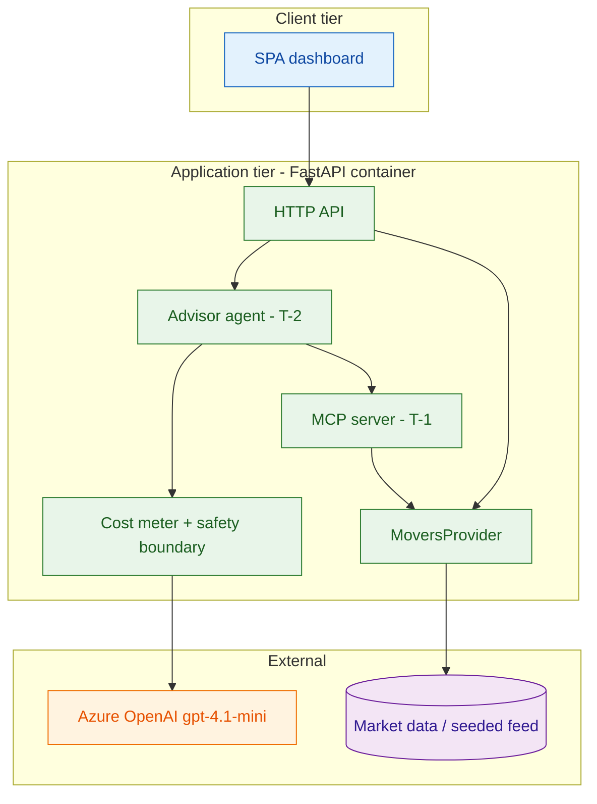

### 1.2 Data architecture

No persistent store. The movers feed is pluggable behind a `MoversProvider`
interface with a `SeededMoversProvider` (JSON fixture; dev/CI/eval) and an
optional live provider. The in-session profile is passed per request, never
stored. Usage records append to `reports/usage/usage.jsonl`. No `internal`/
`confidential`/`restricted` data (spec §14).

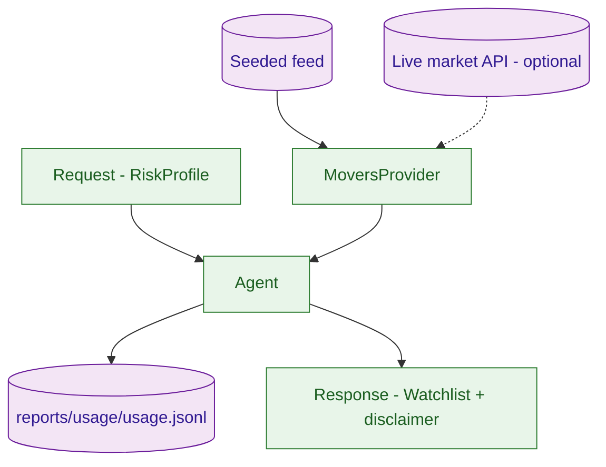

### 1.3 Infrastructure architecture

**Reuse-first.** This baseline reuses the already-live `rg-stock-guru` resource
group (eastus2): existing Azure Container Registry, Azure OpenAI with a
**`gpt-4.1-mini`** deployment, Log Analytics, and the Container Apps environment.
The buildout deploys a **new Container App (`stock-guru-fresh`)** into that
existing environment — no re-provisioning of shared infra, so no second
standing bill. Deploy from GitHub Actions over OIDC.

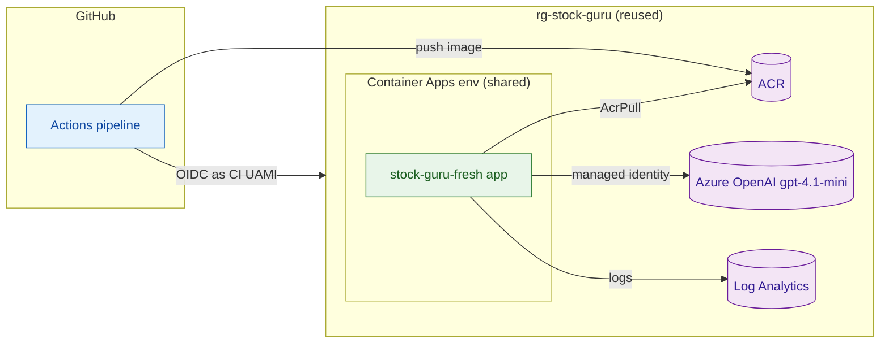

### 1.4 Security architecture

- **App-runtime (workload identity):** the Container App uses a user-assigned
  managed identity for Azure OpenAI (Cognitive Services OpenAI User) and ACR
  (AcrPull). No API keys.
- **CI-to-cloud (short-lived):** GitHub Actions authenticates via OIDC to the
  **existing** CI user-assigned managed identity. A **new GitHub federated
  credential** for `ajai-d/stock-guru-fresh` is added to that UAMI. This tenant
  emits an ID-qualified subject
  (`repo:ajai-d@106365942/stock-guru-fresh@<repoId>:ref:refs/heads/main`); the
  exact `<repoId>` is resolved at bootstrap via the `AADSTS700213` feedback loop
  (`config/cloud/azure.md`). No client secrets in CI (three repo variables carry
  the IDs).
- **Identity bootstrap (one-time):** add the federated credential + confirm role
  assignments under the Human User's `az login`. Delivered by
  `W-1-identity-bootstrap`, sequenced first. No new UAMI is created — the live
  CI identity is reused.

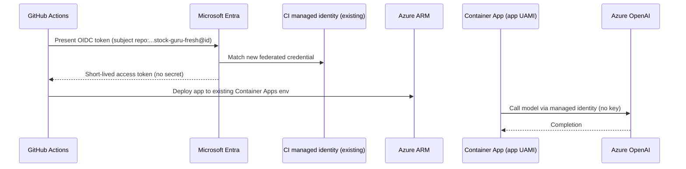

### 1.5 Technology choices

- **Backend:** Python 3.12, FastAPI, Uvicorn/Gunicorn. **Frontend:** static
  HTML/CSS/vanilla-JS SPA (zero build step), served by the backend.
- **Agentic technology proposal (from the bound `agentic-stack`):** agent
  framework = **Microsoft Agent Framework** (Python SDK). Per the deploy-time
  verification the methodology now mandates, the API is pinned to the **current**
  surface: `agent_framework.openai.OpenAIChatCompletionClient` +
  `agent_framework.Agent(client=...)` over **Chat Completions** (api-version
  compatible), reached against the Azure OpenAI endpoint. Model platform =
  **Azure AI Foundry** (Azure OpenAI deployment); model = **`gpt-4.1-mini`**
  (`2025-04-14`); orchestration = single-agent; tool/MCP = minimal MCP server
  exposing T-1; eval/guardrail = custom harness (deterministic scorers + one
  LLM-as-judge) with grounding/schema enforcement applied post-response; skills =
  Impeccable (UI). The model is reached via the app **managed identity** (no
  keys), per `config/cloud/azure.md`.
- **Dependencies:** lean `agent-framework-core` + `agent-framework-openai` with
  relaxed pins (avoids the `agent-framework[all]` resolution conflict).
- **Human User's preferred agentic framework(s):** Microsoft Agent Framework on
  Azure AI Foundry — adopted from the bound `agentic-stack` default.

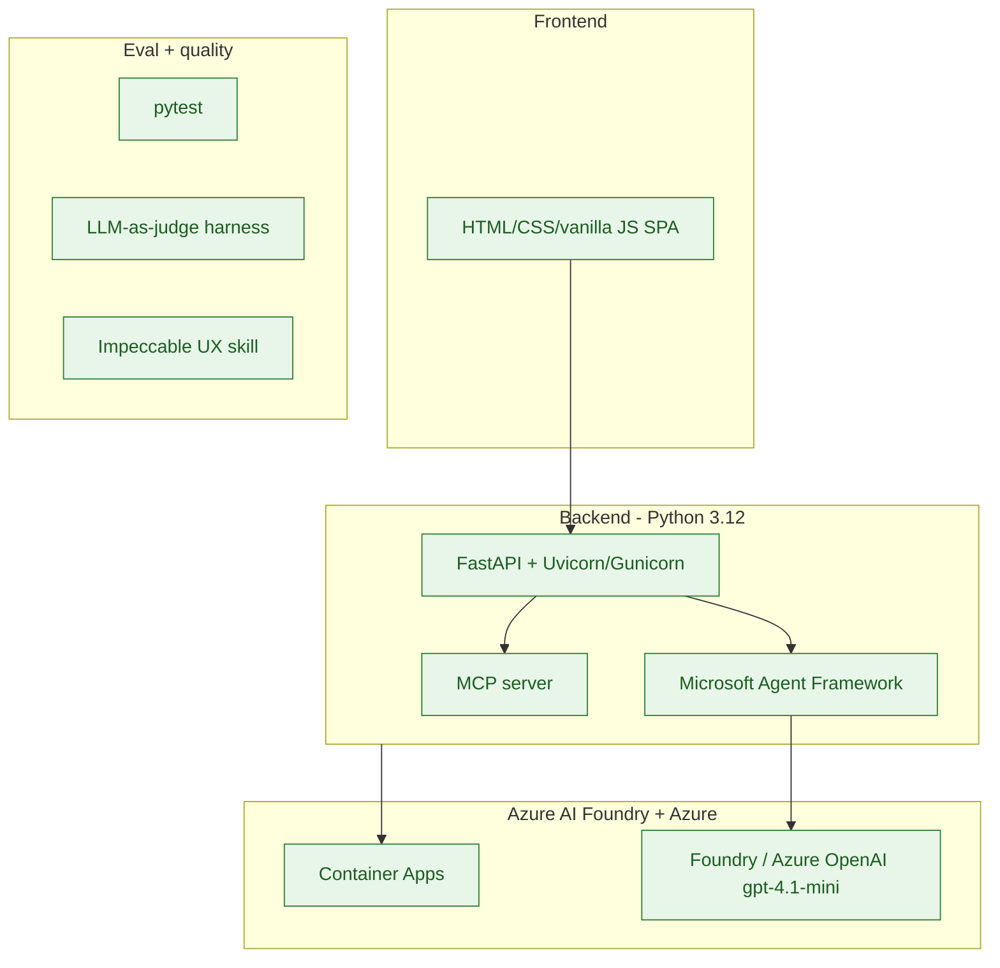

### 1.6 Test architecture

`pytest` unit tests (movers, agent grounding/schema, API) with the seeded feed
and a stubbed model; the evaluation harness scores DIM-1..4 over `cases.jsonl`
and writes `reports/eval/`; safety tests cover disclaimer-drop / invent-ticker /
personalized-advice. **UI tests:** an axe-core accessibility check and a
rendered-UI (headless-browser) test run in CI over **both the light and dark
themes** (spec §13.6). DIM-4 (LLM-judge) runs N=20 at gate time.

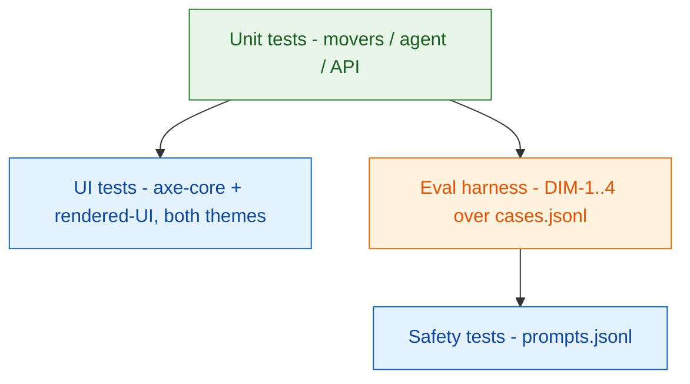

### 1.7 Operations architecture

Container Apps provides logs/metrics via Log Analytics; `/healthz` is the
readiness probe; post-deploy smoke = `curl /healthz`. L2 scope — no separate
3k/3l monitoring/observability beyond platform defaults.

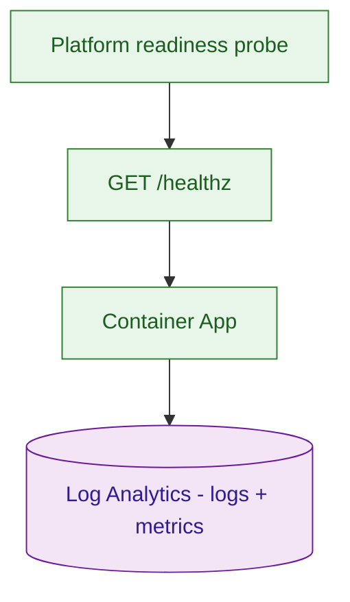

## 2. Design

### 2.1 Application design

Refines: §1.1. Per-use-case sequence flows (spec §5). `Agent.recommend` builds a
prompt, calls the model with a bounded completion + structured output, parses to
`Watchlist`, drops any ticker not in movers (grounding), validates
`confidence ∈ [0,1]` and 3–5 items, meters tokens/cost, attaches the disclaimer;
fails closed on cost cap / schema.

UC-1 — Get a grounded watchlist:

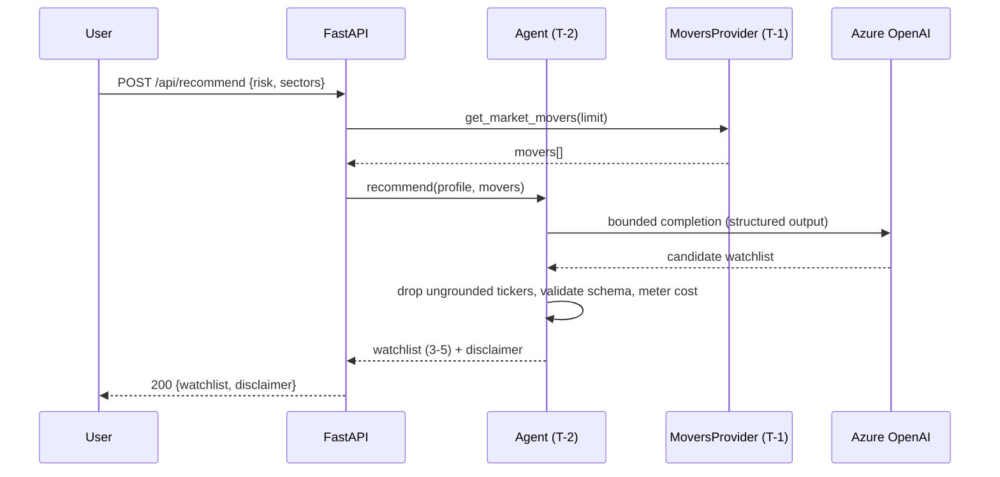

UC-2 — Inspect reasoning and source:

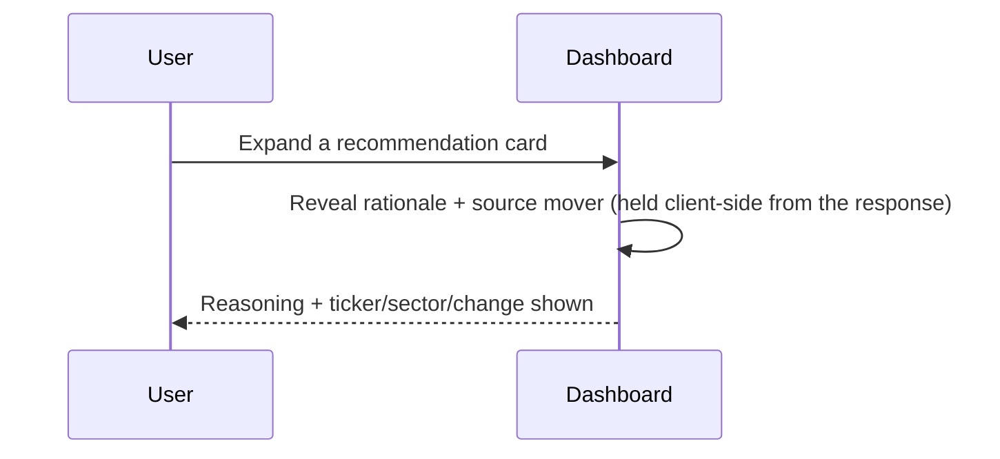

UC-3 — Readiness probe:

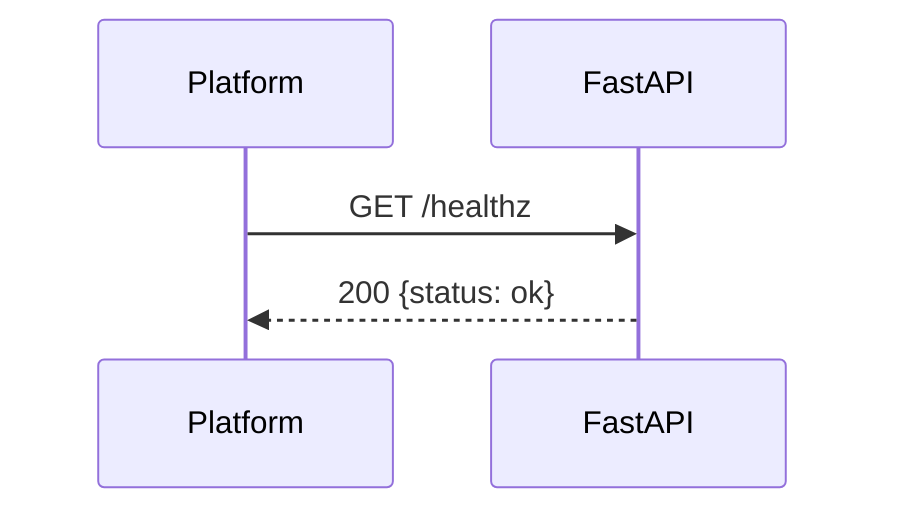

### 2.2 Data design

Refines: §1.2. `Mover { ticker, name, sector, change_pct, price }`;
`RiskProfile { risk, sectors[] }`; `Recommendation { ticker, rationale,
confidence }`; `Watchlist { watchlist[], disclaimer }`; usage record
`{ request_id, tokens_in, tokens_out, est_cost_usd, scope, outcome }`.

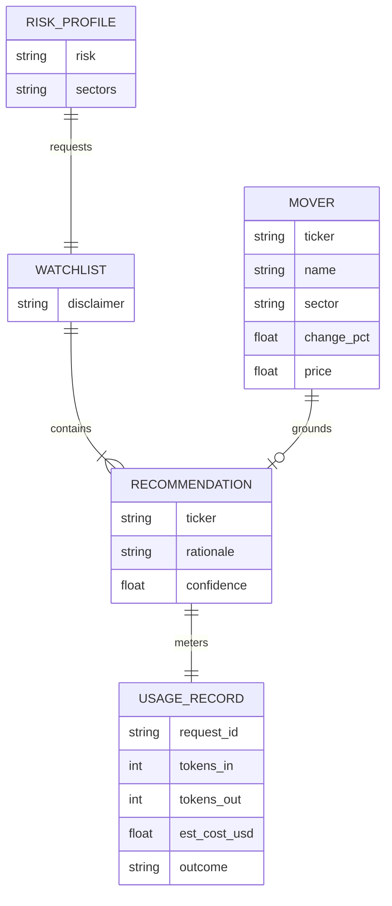

### 2.3 Infrastructure design

Refines: §1.3. Reuse-first: no new shared infra. Bicep `app.bicep` describes only
the new Container App (`stock-guru-fresh`) + its app UAMI role assignments,
targeting the existing Container Apps environment, ACR, AOAI (`gpt-4.1-mini`), and
Log Analytics in `rg-stock-guru`. Resource names are discovered from Azure at
deploy time (decoupled from provisioning).

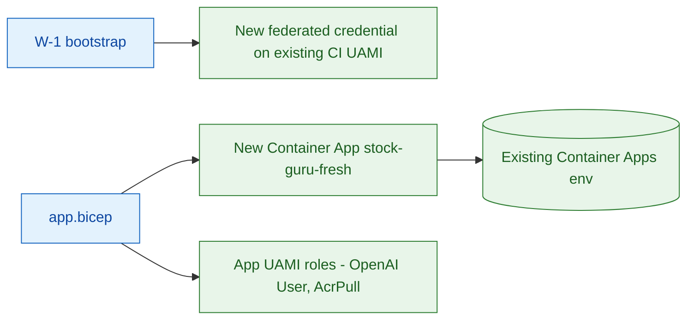

### 2.4 Security design

Refines: §1.4. Roles declared in IaC: existing CI-deploy UAMI (reused; new
federated credential for `stock-guru-fresh`); app UAMI (Cognitive Services OpenAI
User on AOAI, AcrPull on ACR). Federated-credential subject = the actual GitHub
subject (ID-qualified, resolved at bootstrap). No admin user on ACR; Entra-only
auth on AOAI (no keys).

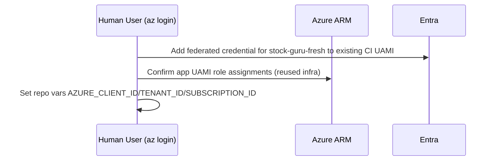

### 2.5 Test design

Refines: §1.6. Unit tests per module; eval harness scores DIM-1/2/3
deterministically (stubbed model returns fixed grounded/ungrounded outputs to
exercise the scorers) and DIM-4 via LLM-judge (N=20 at gate). Safety fixtures
assert disclaimer presence and rejection of ungrounded/advice outputs. UI tests
render the page and run axe-core + a rendered-UI assertion over the light and the
dark theme.

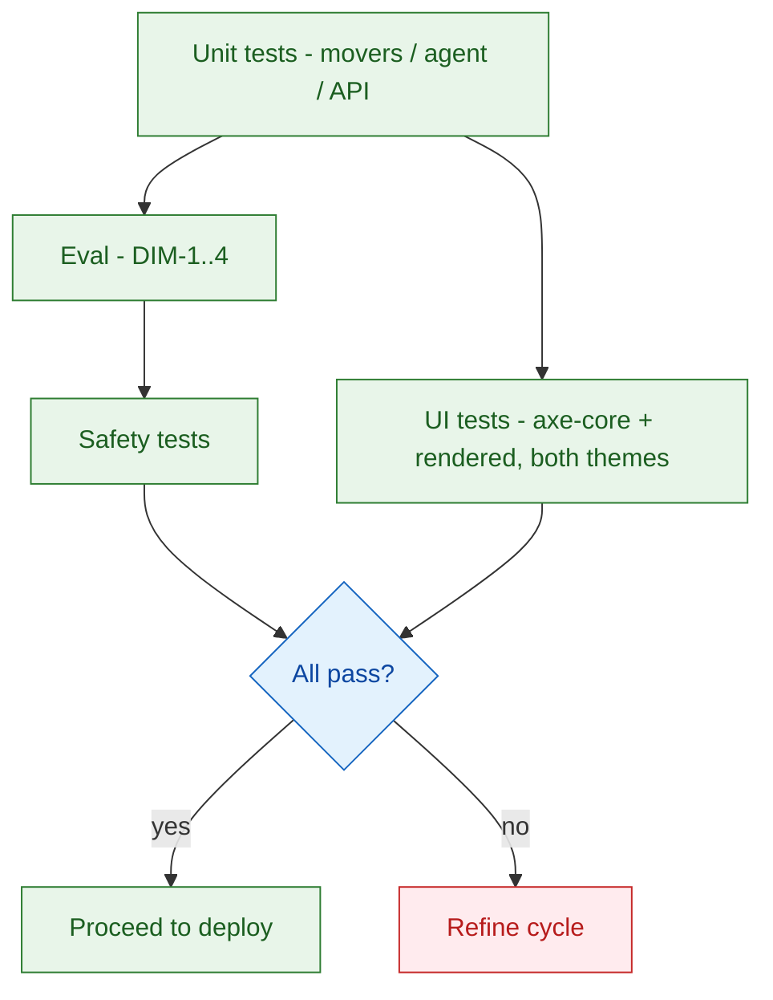

### 2.6 UX design

Realizes: spec §13 (UX mode Delegated). Produced through the bound **Impeccable**
skill's full authored process (`init` → `concept-seed --scope direction --mode
operate` → build → `detect` → fix), **not** asserted.

**Visual world — "Daily Market Broadsheet."** A deliberately distinctive editorial
design (the cultural home of a daily financial tip-sheet), chosen to avoid the
generic "AI-default" look. Impeccable lends only type, palette, density, and one
signature move; navigation and controls stay standard web.

- **Type:** serif masthead/numerals (Iowan Old Style / Palatino / Georgia stack);
  grotesk for labels (`"Helvetica Neue", Arial, system-ui` — deliberately **not**
  Inter/Roboto, which `detect` flags as overused); monospace for figures.
- **Signature move:** pip-confidence meter (●●●●○) paired with the numeric value —
  honest uncertainty, not color-only.
- **Two themes, one token set:** `:root`/`[data-theme="light"]` = FT-salmon
  broadsheet (ground `#efcebb`, press-red spot `#93291f`, warm dark inks);
  `[data-theme="dark"]` = evening edition (slate `#14161c`, ivory `#ece6da`, gilt
  gold `#e3ab4f`, red disclaimer notice). Every component colour (accent, notice,
  up/down, pip fill, controls) flows through tokens, so both themes stay
  consistent with no duplicated component CSS.
- **Mode toggle:** accessible button in the masthead eyebrow (`aria-pressed`,
  keyboard-operable, visible focus ring), defaulting to the OS
  `prefers-color-scheme`.

**Information architecture.** Single page, two regions: a **profile panel** (risk
selector + sector multi-select + "Get recommendations" primary action) and a
**results area** of recommendation cards with expandable reasoning + source
mover. A persistent masthead carries the product name and the always-visible
"Not financial advice" notice. Empty, loading, and error states are first-class.

**Wireframe artifact + evidence.** The rendered mockup lives at
`plan/wireframes/dashboard.html` (a real HTML/CSS artifact, both themes behind
the token set and the toggle).

- **Design-quality scan:** Impeccable `detect` reports **0 anti-patterns** on the
  mockup — verified in **both** the light and the dark theme (AC-11; spec §13.6).
- **Rendered evidence:** the mockup was rendered in a browser and screenshotted in
  **both** modes, and approved by the Human User before being locked here (per
  sdlc §10 "Design evidence"). Light = FT-salmon broadsheet; dark = slate/gilt
  evening edition; the masthead toggle flips between them.

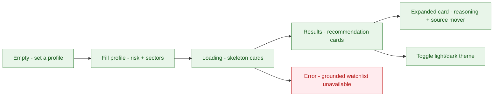

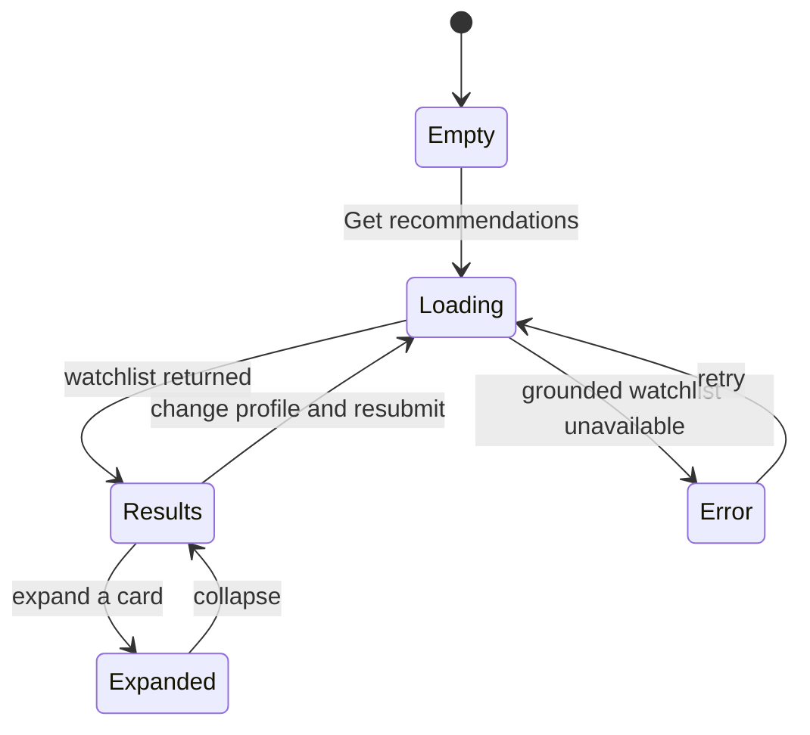

### 2.7 API design

Realizes: spec §15. REST/JSON, three endpoints, `{error:{code,message}}` errors,
disclaimer always in `/api/recommend` responses, `limit` capped at 50.

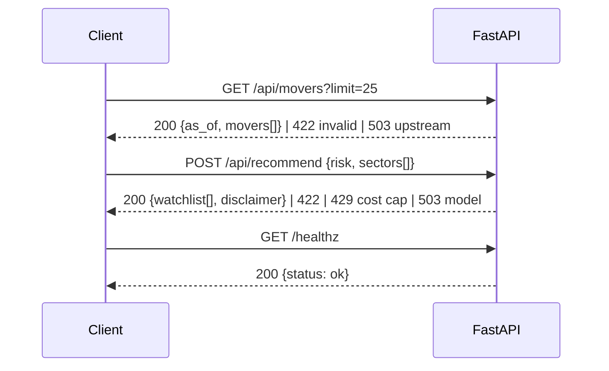

## 3. Orchestration

### 3.1 Work breakdown

- **W-1-identity-bootstrap** — add a GitHub federated credential for
  `ajai-d/stock-guru-fresh` to the **existing** CI UAMI; guided one-time apply +
  OIDC verify (AADSTS700213 loop). First. No new UAMI (reuse-first).
- **W-2-infra** — `infra/app.bicep` for the new Container App (`stock-guru-fresh`)
  + app UAMI role assignments, targeting the existing `rg-stock-guru` env/ACR/
  AOAI(`gpt-4.1-mini`)/Log Analytics. No re-provisioning of shared infra.
- **W-3-movers** — `MoversProvider` + `SeededMoversProvider` + fixture + MCP
  server exposing T-1; unit tests.
- **W-4-eval** — evaluation harness: `tests/eval/data/cases.jsonl`, scorers for
  DIM-1 (grounding), DIM-2 (schema), DIM-3 (disclaimer), DIM-4 (rationale,
  LLM-judge), report writer → `reports/eval/`; safety tests `tests/safety/`.
- **W-5-agent** — T-2 `recommend` (model via managed identity over Chat
  Completions, structured output, grounding + schema enforcement, cost metering,
  safety boundary); unit tests. LLM-driven behavior.
- **W-6-api** — FastAPI `/healthz`, `/api/movers`, `/api/recommend`; tests.
- **W-7-ui** — SPA dashboard built from the locked §2.6 wireframe (broadsheet,
  light/dark token set + mode toggle), served by the backend; axe-core +
  rendered-UI tests over both themes; `detect` clean re-verified on the shipped
  markup.
- **W-8-cicd** — GitHub Actions: test + eval + UI tests → OIDC login → build/push
  image → deploy to the existing Container Apps env → smoke `/healthz`. Provision
  step gated on `infra/**` changes only.

### 3.2 Sequencing and dependencies

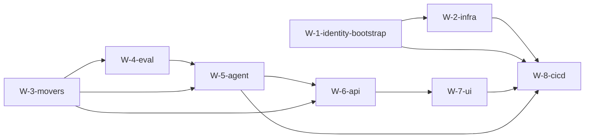

- **Identity first:** `W-1-identity-bootstrap` precedes every deploy/provision and
  any cloud-auth code (sdlc §9 "Identity before code").
- **Eval-first edge:** `W-5-agent` **depends on `W-4-eval`** — scorers and dataset
  exist before the LLM behavior they gate (agentic addendum §3.2).
- Sequential pattern; no parallel dispatch.

## PLAN-EXIT validation checklist (self-verified)

- §1.1–§1.7 present and non-empty; §1.4 declares app-runtime workload identity +
  CI OIDC + identity-bootstrap (reuse-first). ✅
- §1.5 records the agentic technology proposal (current Agent Framework API,
  `gpt-4.1-mini`) + Human User's preferred framework. ✅
- §2 design present; §2.6 UX + §2.7 API present (modes ≠ N/A). **§2.6 records the
  renderable Impeccable artifact, a clean `detect` scan for both themes, and the
  Human-User-approved rendered evidence (PLAN-EXIT rule 16).** ✅
- **Diagrams (checklist item 19):** `mermaid` fenced block present in §1.1, §1.3,
  §1.4, §1.5, §1.6, §2.1 (a `sequenceDiagram` for each of UC-1/UC-2/UC-3), §2.2,
  §2.3, §2.4, §2.5, §2.6 (UX flow + `stateDiagram-v2`), §2.7, and §3.2 (DAG). ✅
- §3.1 includes a `W-<n>-eval` item (W-4-eval); §3.2 shows identity-bootstrap
  first and the eval-first edge (`W-5-agent depends on W-4-eval`). ✅
- Each §10 dimension (DIM-1..4) traces to W-4-eval (dataset + scorer + report). ✅
